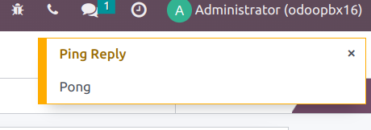
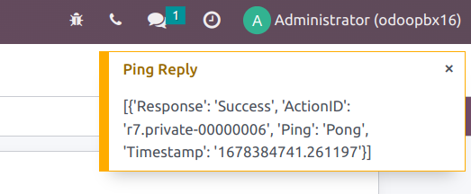

=============
Asterisk Plus
=============

This article explains how to install ``Asterisk Plus`` Odoo addon from `OdooPBX <http://odoopbx.com>`_.

Install the addon in Odoo
=========================
First, download the addon from `Odoo market <https://apps.odoo.com/apps/modules/16.0/asterisk_plus/>`_

Install the addon as any other Odoo module, refer to `Odoo documentation <https://www.odoo.com/documentation/16.0/applications/general/apps_modules.html#>`_
for details if needed.

Install python requirements
---------------------------
Install python dependancy libraries with command:

.. code-block:: bash

    pip3 install humanize lameenc phonenumbers nats-python

If you use odoo.sh make sure you have ``requirements.txt`` file in your modules top folder containing:

.. code::

    humanize
    lameenc
    phonenumbers
    nats-python
    
So that odoo.sh can install the required dependencies.

If you use python virtualenv make sure you install the requirements there and not system wide.

Odoo version 10 uses python2, so use command ``pip`` instead of ``pip3``.

Configure settings
==================
Go to ``PBX -> Settings -> Server`` and make sure all settings are correct for your environment,
especially:

 * ``AMI Host`` and ``AMI Port`` for connecton from cloud service to your PBX AMI interface
 * ``Built-in HTTP URL`` for connection from cloud service to your PBX HTTP interface
 * ``WEB Base URL`` for connection from cloud serivce to your Odoo

Then press :guilabel:`Activate` button.
You will directed to `apps.odoopbx.com <https://apps.odoopbx.com>`_
for choosing and purchasing your subsription plan.

Upon success you get your  subscription code, which looks like
*9f058258-1e63-4937-b2a1-a2eaa4dbcb11*, and enter it in activation form.

Check connectivity
==================
Press :guilabel:`Agent Ping` button  and you should get pop-up notification.

Press :guilabel:`ASTERISK PING` button  and you should get another pop-up notificaiton:

If neither pop-up notification nor errors are displayed, check 
`Odoo longpolling <../install/odoo.html#long-polling>`_ settings.

